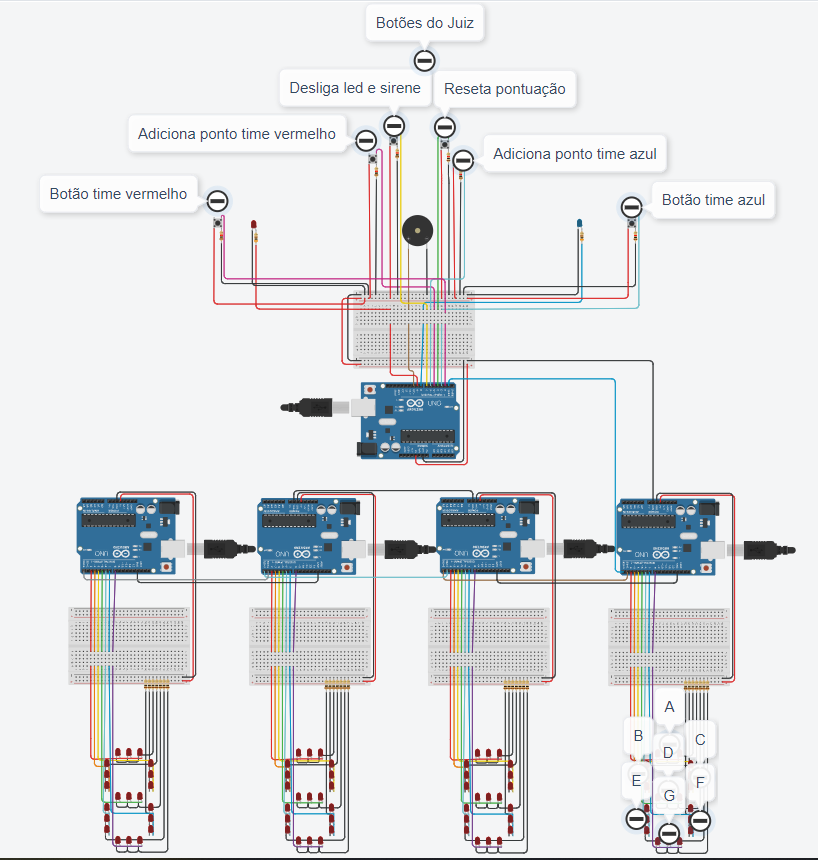

# Placar de Pontuação com Arduino

Este projeto consiste em um placar de pontuação utilizando Arduino, inspirado no jogo "Passa ou Repassa", projetado para dois jogadores. O jogo inclui um sistema de pontuação, luzes de alarme e um botão de desativação para o juiz.

## Funcionalidades

- **Botões de Acionamento:** Cada time tem um botão de acionamento. Ao pressionar o botão, o jogo é iniciado para o respectivo time, ativando a sirene e a luz de alarme correspondente.
- **Sirene e Luz de Alarme:** Ao pressionar o botão de acionamento, a sirene e a luz de alarme do time correspondente são ativadas. Elas permanecem ligadas por um tempo pré-determinado (3 segundos) ou até que sejam desativadas pelo juiz.
- **Desativação do Alarme:** O juiz tem um botão para desativar a sirene e a luz de alarme quando necessário, seja após um tempo determinado ou se houver uma violação das regras do jogo.
- **Pontuação:** O juiz tem botões para adicionar pontos para cada time. Os pontos são exibidos em placares compostos de LEDs simples que formam displays de 7 segmentos, cada segmento com 3 LEDs.
- **Reset do Placar:** O juiz tem um botão para resetar os placares, zerando a pontuação de ambos os times.

## Regras do Jogo

Neste projeto, vamos criar um jogo no estilo "Passa ou Repassa" utilizando o Arduino em uma plataforma de simulação como o Tinkercad. O jogo é projetado para dois jogadores, com um sistema de pontuação, luzes de alarme e um botão de desativação para o juiz.

### O que será preciso fazer no projeto:

1. Monte os componentes na plataforma Tinkercad ou uma plataforma de simulação similar à qual eu possa ter acesso, incluindo a placa Arduino, botões, LEDs, etc.
2. Conecte os componentes de acordo com o esquemático do circuito.
3. Escreva o código Arduino para controlar o funcionamento do jogo, incluindo a lógica para acionar a sirene, luzes de alarme, pontuação e reset do placar.

## Circuito Elétrico

Abaixo está o circuito elétrico do projeto realizado na plataforma Tinkercad:

## Contribuição

Sinta-se à vontade para contribuir com melhorias neste projeto. Você pode abrir problemas para relatar bugs ou solicitar novos recursos.

## Licença

Este projeto está licenciado sob a [MIT License](LICENSE).
